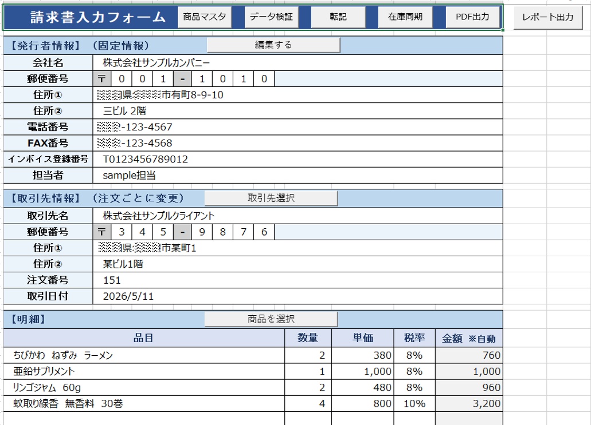
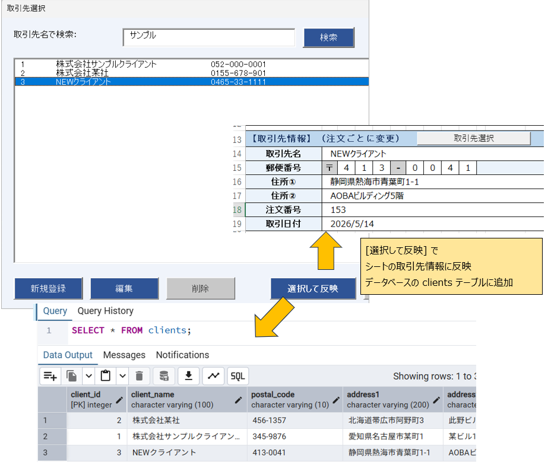
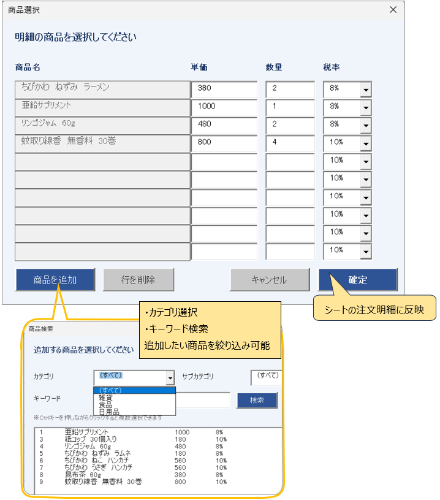
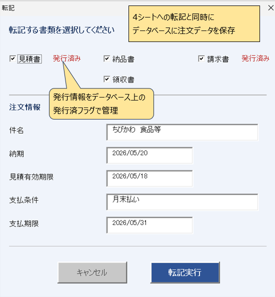
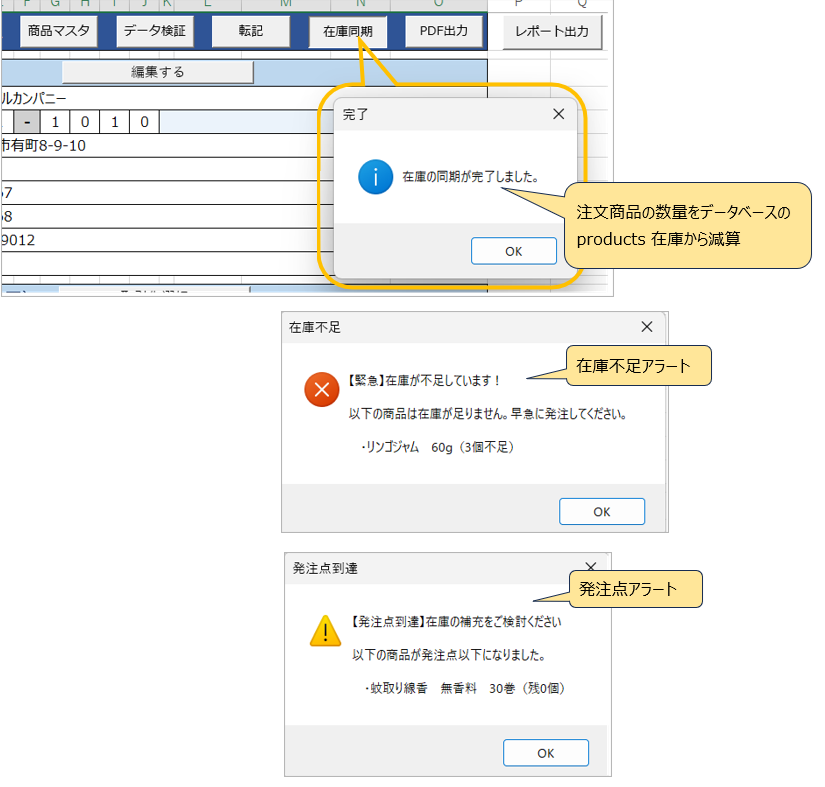
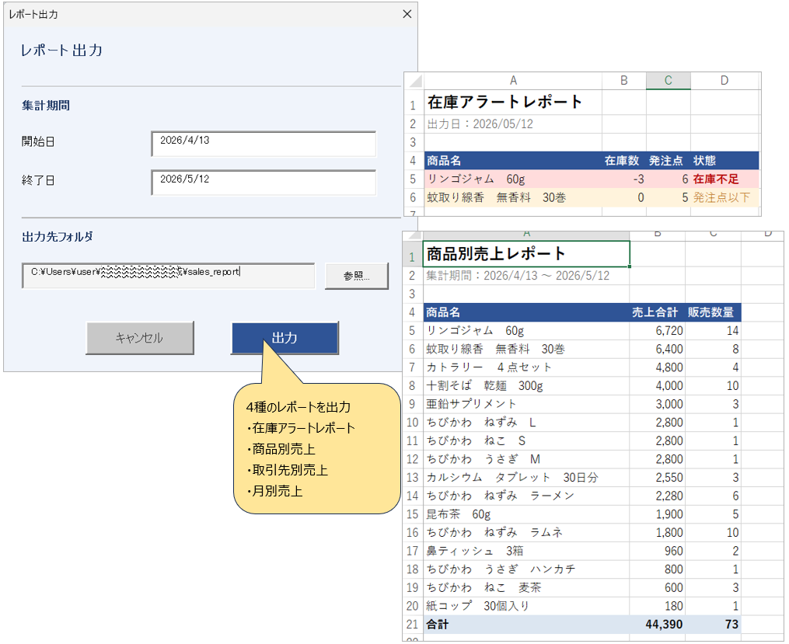
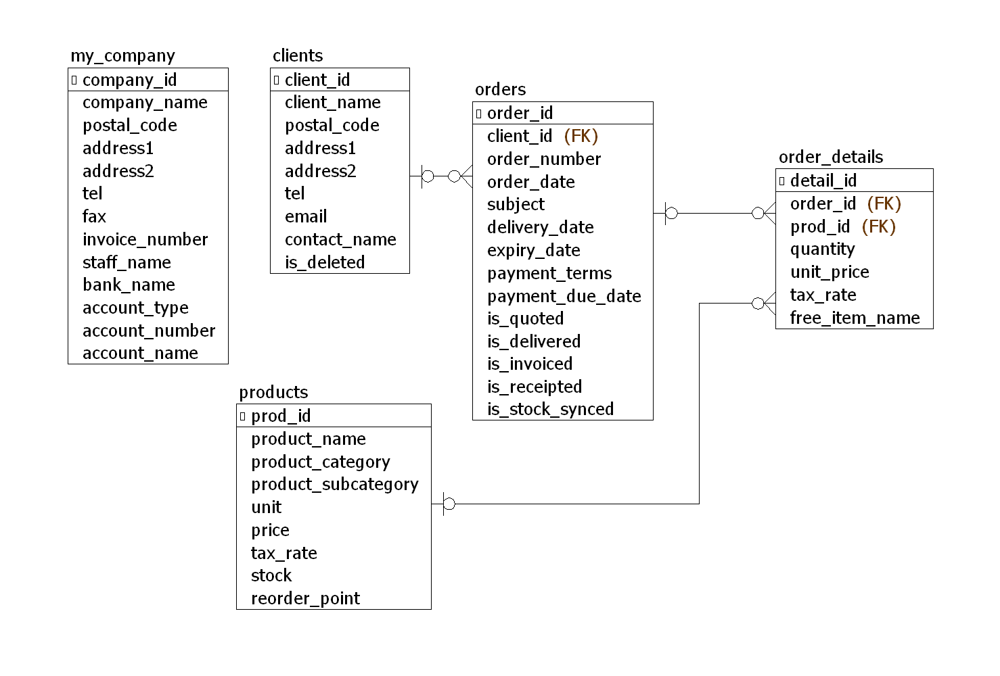

# Excel VBA × PostgreSQL 在庫・売上管理システム

## 概要
ExcelVBAとPostgreSQLを組み合わせた在庫・売上管理システムです。
実務で培ったVBAスキルとSQLの学習成果をポートフォリオとしてまとめました。

## 使用技術
- Excel VBA（ユーザーフォーム・クラスモジュール）
- PostgreSQL 18
- ODBC接続（psqlODBC）

## 主な機能
- 取引先マスタ管理（登録・編集・論理削除）
- 商品マスタ管理（登録・編集・論理削除）
- 受注入力・PDF出力
- 在庫同期・二重減算防止
- 在庫不足アラート・発注点警告
- 売上レポート出力（月別・取引先別・商品別・在庫アラート）

## 画面構成
| フォーム名 | 機能 |
|---|---|
| frmClientSelect / frmClientEdit | 取引先マスタ |
| frmProductSelect / frmProductEdit | 商品マスタ |
| frmItemSelect / frmItemSearch | 商品選択 |
| frmTransfer | 受注転記・DB保存 |
| frmPDFSelect | PDF出力 |
| frmReport | 売上レポート出力 |

## DB構成
- my_company（発行者情報）
- clients（取引先）
- products（商品）
- orders（注文）
- order_details（注文明細）

## 画面キャプチャ

### メイン画面

### 取引先選択

### 商品選択

### 転記

### 在庫同期・アラート

### レポート出力

## ER図
 

## 実行環境
- Windows 11
- Excel 2019
- PostgreSQL 18
- psqlODBC（DSN名：inventory_dsn）
